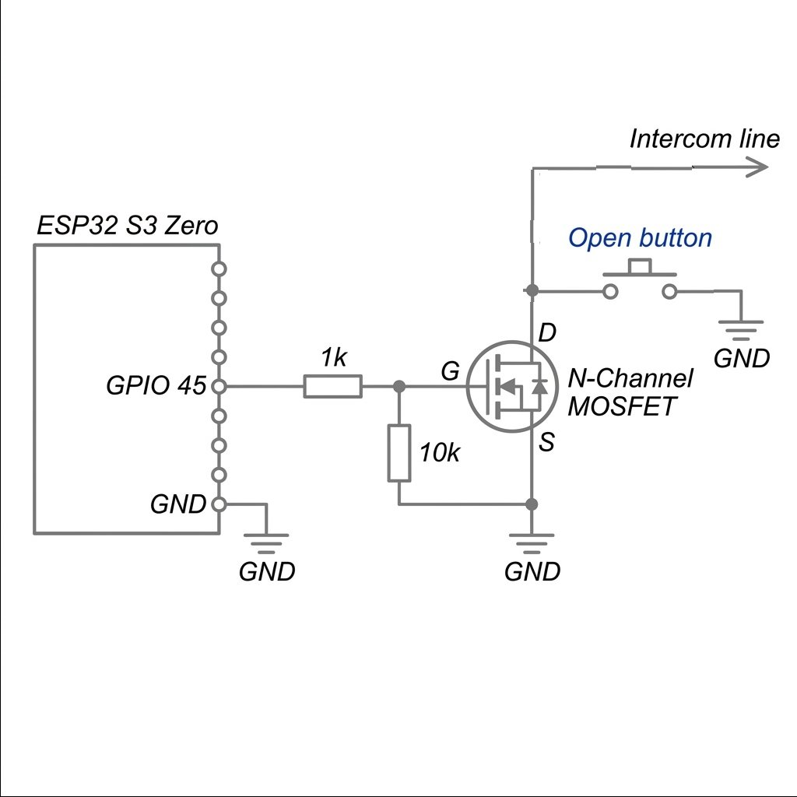

# DoorBell — Telegram Bot Integration

This project is an ESP32-S3-Zero based firmware that bridges a **generic intercom/doorbell system** to **Telegram**. It allows you to receive notifications on your phone when someone rings the doorbell and remotely open the door by replying with a simple command.

## 🚀 Features

- **Instant Notifications**: Sends a Telegram message immediately when the doorbell rings.
- **Remote Unlock**: Reply `open` or `/open` to the bot to activate the door relay.
- **Whitelist Security**: Only authorized users can open the door. The Admin can add/remove users via Telegram commands.
- **Visual Feedback**: Onboard WS2812 RGB LED indicates the current system status (Connecting, Online, Ringing, Error).
- **Web-based Provisioning Portal**: Configure WiFi and Telegram credentials dynamically via a captive portal when starting fresh, no hardcoded secrets required.
- **No Extra Backend**: Communicates directly with the Telegram Bot API over HTTPS. No MQTT broker, separate backend server, or custom mobile app required.
- **Debouncing**: Built-in 5-second debounce to prevent spamming notifications if the doorbell is pressed multiple times quickly.

## 🔌 Hardware Setup

You will need an **ESP32-S3-Zero** (or similar ESP32-S3 board) connected as follows:

| Component | ESP32-S3 Pin | Description |
|-----------|--------------|-------------|
| Ring detector | `GPIO 4` | Input from doorbell ring signal (pulled down internally). |
| Door relay | `GPIO 45` | Output to door lock relay (active high for 2 seconds). |
| WS2812 LED | `GPIO 21` | Onboard status indicator (varies by board, check your schematic). |
| BOOT button | `GPIO 0` | Long-press for 5 seconds to factory reset (erase NVS credentials). |

## 🔧 Door Relay Circuit — N-Channel MOSFET Bypass

To trigger the door lock remotely, the ESP32 uses an **N-Channel MOSFET** wired in parallel with the physical "Open" button on the intercom. When `GPIO 45` goes HIGH, the MOSFET conducts (Drain→Source), effectively "pressing" the button electronically.

### Wiring Diagram



### Component List

| Component | Value | Purpose |
|-----------|-------|---------|
| Q1 — N-Channel MOSFET | 2N7000 / BS170 / IRLZ44N | Main switch, bypasses the button |
| R1 — Gate resistor | 1 kΩ | Limits inrush current to Gate from ESP32 GPIO |
| R2 — Pull-down resistor | 10 kΩ | Ensures Gate is LOW (MOSFET off) when GPIO floats |

### How It Works

1. `GPIO 45` is `LOW` at rest → MOSFET is **OFF** → button circuit open, door stays locked.
2. Firmware drives `GPIO 45` **HIGH** for 2 seconds → Gate rises above V_th → MOSFET **conducts** (Drain→Source) → intercom sees button pressed → door unlocks.
3. GPIO returns LOW → MOSFET turns off instantly.

> [!WARNING]
> The intercom button circuit typically carries **low-voltage DC (5–24 V)**. Always verify the voltage across the button terminals before wiring. Do **not** connect the MOSFET directly to mains AC. If the intercom uses AC or voltages > 30 V, use an optocoupler or relay instead.

> [!TIP]
> If the MOSFET gate threshold (V_th) is close to 3.3 V (e.g., IRLZ44N, logic-level MOSFETs), it will switch reliably from the ESP32 GPIO. Standard MOSFETs (e.g., IRF540) require a higher gate voltage and may not fully switch with 3.3 V — prefer **logic-level** variants.

## 🚦 LED Status Indicators

| Color | Pattern | Meaning |
|-------|---------|---------|
| 🟡 Yellow | Blink | Connecting to WiFi |
| 🟢 Green | Solid | Online, polling Telegram for commands |
| ⚪️ White | Fast blink | Doorbell is ringing! |
| 🔴 Red | Blink | Error or Factory Resetting |

## 🛠️ Software Installation

This project is built using the [ESP-IDF framework](https://docs.espressif.com/projects/esp-idf/en/latest/esp32s3/get-started/).

### 1. Create a Telegram Bot

1. Open Telegram and search for **@BotFather**.
2. Send `/newbot` and follow the prompts to create your bot.
3. Copy the **Bot Token** (it looks like `123456789:ABCdefGHIjklMNOpqrSTUvwxYZ`).
4. Create a new Telegram Group or use your personal chat with the bot.
5. Get your **Chat ID** (a numeric value, e.g., `123456789` or `-100123456789` for groups) using **@userinfobot** or **@RawDataBot**. *Note: The bot cannot send messages to its own username.*

### 2. Web Provisioning & Initial Setup

The firmware uses a web-based provisioning portal, removing the need to hardcode secrets into the source code.

1. Build and flash the firmware (see step 3).
2. If it's a fresh installation (no credentials in NVS), the device will start in **Access Point (AP) mode** with a captive portal.
3. Connect your phone or laptop to the WiFi network broadcast by the ESP32 (e.g., `DoorBell_Setup`).
4. A captive portal should appear automatically, or you can navigate to `http://192.168.4.1` in your browser.
5. In the web interface, configure your:
   - **WiFi SSID & Password**
   - **Telegram Bot Token**
   - **Telegram Chat ID**
   - **Telegram Admin User ID**: (Required for whitelist functionality). Only this numeric user ID will be able to add/remove other users. You can get your User ID from @userinfobot.
6. Save the settings. The ESP32 will save them to NVS and reboot to connect to your WiFi and Telegram.

*(If you ever need to change these settings, press and hold the BOOT button on the ESP32 for 5 seconds to factory reset and return to AP provisioning mode).*

### 3. Build & Flash

```bash
idf.py build
idf.py -p /dev/tty.usbmodem* flash monitor
```

## 🏗️ Architecture

- **`main.c`**: Entry point. Initializes NVS, establishes WiFi connection, and spawns the network-ready task. Also handles the BOOT button factory reset.
- **`web_server.c/h`**: Implements the captive portal and web-based administration interface for initial WiFi/Telegram configuration and basic management.
- **`telegram_bot.c/h`**: Implements the HTTPS client for the Telegram Bot API. It uses `sendMessage` to push notifications and long-polls `getUpdates` (every 2s with a 5s timeout) to receive commands, utilizing the ESP-IDF `esp_http_client` and the mbedTLS certificate bundle.
- **`doorbell_logic.c/h`**: Manages GPIOs. Polls GPIO 4 for the ring signal (with a 5s debounce) and pulses GPIO 45 for 2 seconds when an `open` command is received.
- **`led_status.c/h`**: Drives the onboard WS2812 RGB LED via the RMT peripheral to reflect system states.

## 💬 Telegram Commands

Once the device is online (Green LED), you can interact with it via Telegram:

**General Commands (Requires Authorization):**
| Command | Action |
|---------|--------|
| `open` or `/open` | Triggers the door relay for 2 seconds to unlock the door. |

**Admin Commands (Only accepted from Admin ID):**
| Command | Action |
|---------|--------|
| `/add <user_id>` | Adds a Telegram User ID to the whitelist so they can open the door. |
| `/remove <user_id>` | Removes a User ID from the whitelist. |
| `/list` | Shows the list of currently authorized User IDs. |

## 📝 License

This project is open-source. Feel free to modify and adapt it to your needs!

## ⚠️ Disclaimer

The author is not responsible for any damage, property loss, or violation of home rules, building codes, or local laws caused by the use of this software or hardware modifications. You are modifying building infrastructure at your own risk. Please ensure you have permission to interface with the intercom system in your building.
